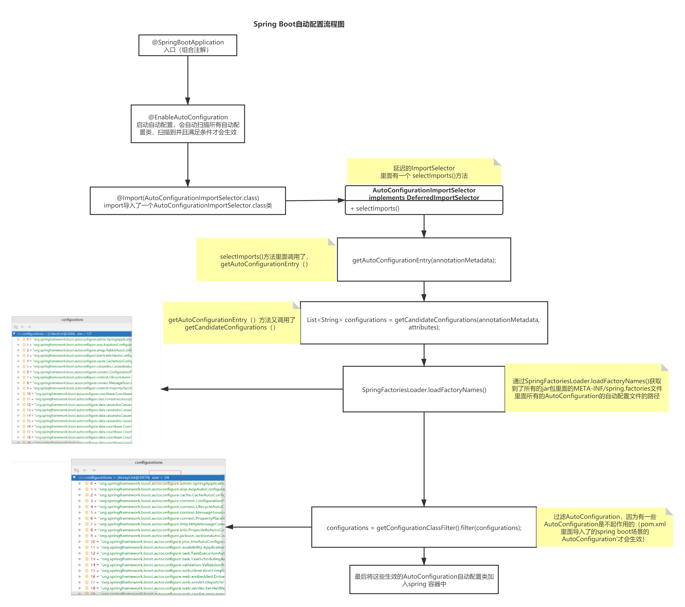

# 自动配置原理

https://blog.csdn.net/JAVAlife2021/article/details/123563751

以主程序类为例

```java
package com.stanlong;

import org.springframework.boot.SpringApplication;
import org.springframework.boot.autoconfigure.SpringBootApplication;

/**
 * 主程序类
 * @SpringBootApplication 标识这是一个SpringBoot应用
 */
@SpringBootApplication
public class MainApplication {
    public static void main(String[] args) {
        SpringApplication.run(MainApplication.class, args);
    }
}
```

`@SpringBootApplication` 是一个合成注解，源码如下：

```java
@Target(ElementType.TYPE)
@Retention(RetentionPolicy.RUNTIME)
@Documented
@Inherited
@SpringBootConfiguration
@EnableAutoConfiguration
@ComponentScan(
    excludeFilters = {@Filter(
    type = FilterType.CUSTOM,
    classes = {TypeExcludeFilter.class}
), @Filter(
    type = FilterType.CUSTOM,
    classes = {AutoConfigurationExcludeFilter.class}
)}
)
public @interface SpringBootApplication {
    ...
}
```

主要关注的几个注解如下
`@SpringBootConfiguration`：标记当前类为配置类
`@EnableAutoConfiguration`：开启自动配置
`@ComponentScan`：扫描主类所在的同级包以及下级包里的Bean

关键是 `@EnableAutoConfiguration`,  `@EnableAutoConfiguration` 也是一个合成注解，源码如下

```java
@Target(ElementType.TYPE)
@Retention(RetentionPolicy.RUNTIME)
@Documented
@Inherited
@AutoConfigurationPackage
@Import(AutoConfigurationImportSelector.class)
public @interface EnableAutoConfiguration {
    String ENABLED_OVERRIDE_PROPERTY = "spring.boot.enableautoconfiguration";

    Class<?>[] exclude() default {};

    String[] excludeName() default {};
}
```

关注如下两个注解 `@AutoConfigurationPackage`,  `@Import(AutoConfigurationImportSelector.class)`

- `@AutoConfigurationPackage` : 自动配置包，就是将主配置类（`@SpringBootConfiguration`标注的类）的所在包及下面所有子包里面的所有组件扫描到Spring容器中，其源码如下：

```java
@Import(AutoConfigurationPackages.Registrar.class)  //给容器中导入一个组件 Registrar
public @interface AutoConfigurationPackage {}

// 说明：
// 利用Registrar给容器中导入一系列组件
// 将指定的一个包下的所有组件导入进来 MainApplication(主程序类) 所在包下。
```

- `@Import(AutoConfigurationImportSelector.class)`

该注解的大概流程就是：一启动就要给容器默认加载 spring-boot-autoconfigure-x.x.x.jar包中 `META-INF/spring.factories`文件中的所有配置类，按照条件装配规则（@Conditional），最终会按需配置。

部分源码如下：

```java
public String[] selectImports(AnnotationMetadata annotationMetadata) {
	if (!this.isEnabled(annotationMetadata)) {
		return NO_IMPORTS;
	} else {
        AutoConfigurationImportSelector.AutoConfigurationEntry autoConfigurationEntry = this.getAutoConfigurationEntry(annotationMetadata); // 核心方法
        return StringUtils.toStringArray(autoConfigurationEntry.getConfigurations());
    }
}
```

```java
/**
 * getAutoConfigurationEntry(annotationMetadata) 源码
 */
protected AutoConfigurationEntry getAutoConfigurationEntry(AnnotationMetadata annotationMetadata) {
		if (!isEnabled(annotationMetadata)) {
			return EMPTY_ENTRY;
		}
		AnnotationAttributes attributes = getAttributes(annotationMetadata);
		List<String> configurations = getCandidateConfigurations(annotationMetadata, attributes);
		configurations = removeDuplicates(configurations);
		Set<String> exclusions = getExclusions(annotationMetadata, attributes);
		checkExcludedClasses(configurations, exclusions);
		configurations.removeAll(exclusions);
		configurations = getConfigurationClassFilter().filter(configurations);
		fireAutoConfigurationImportEvents(configurations, exclusions);
		return new AutoConfigurationEntry(configurations, exclusions);
	}

```

# 自动配置流程



## 二、初始加载自动配置类

#### @Import(AutoConfigurationImportSelector.class)

1. 利用`getAutoConfigurationEntry(annotationMetadata);`给容器中批量导入一些组件
2. 调用`List<String> configurations = getCandidateConfigurations(annotationMetadata, attributes)`获取到所有需要导入到容器中的配置类
3. 利用工厂加载 `Map<String, List<String>> loadSpringFactories(@Nullable ClassLoader classLoader);`得到所有的组件
4. 从`META-INF/spring.factories`位置来加载一个文件。
   - 默认扫描我们当前系统里面所有`META-INF/spring.factories`位置的文件
   - `spring-boot-autoconfigure-2.3.4.RELEASE.jar`包里面也有`META-INF/spring.factories`


虽然我们127个场景的所有自动配置启动的时候默认全部加载，但是`xxxxAutoConfiguration`按照条件装配规则（`@Conditional`），最终会按需配置。

如`AopAutoConfiguration`类：

```java
@Configuration(
    proxyBeanMethods = false
)
@ConditionalOnProperty(
    prefix = "spring.aop",
    name = "auto",
    havingValue = "true",
    matchIfMissing = true
)
public class AopAutoConfiguration {
    public AopAutoConfiguration() {
    }
	...
}
```

## 三、自动配置流程


以`DispatcherServletAutoConfiguration`的内部类`DispatcherServletConfiguration`为例子:

```java
@Bean
@ConditionalOnBean(MultipartResolver.class)  //容器中有这个类型组件
@ConditionalOnMissingBean(name = DispatcherServlet.MULTIPART_RESOLVER_BEAN_NAME) //容器中没有这个名字 multipartResolver 的组件
public MultipartResolver multipartResolver(MultipartResolver resolver) {
	//给@Bean标注的方法传入了对象参数，这个参数的值就会从容器中找。
	//SpringMVC multipartResolver。防止有些用户配置的文件上传解析器不符合规范
	// Detect if the user has created a MultipartResolver but named it incorrectly
	return resolver;//给容器中加入了文件上传解析器；
}
```

SpringBoot默认会在底层配好所有的组件，但是**如果用户自己配置了以用户的优先**。


**总结**：

- SpringBoot先加载所有的自动配置类  xxxxxAutoConfiguration
- 每个自动配置类按照条件进行生效，默认都会绑定配置文件指定的值。（xxxxProperties里面读取，xxxProperties和配置文件进行了绑定）
- 生效的配置类就会给容器中装配很多组件
- 只要容器中有这些组件，相当于这些功能就有了
- 定制化配置
  - 用户直接自己@Bean替换底层的组件
  - 用户去看这个组件是获取的配置文件什么值就去修改。

**xxxxxAutoConfiguration ---> 组件 ---> xxxxProperties里面拿值  ----> application.properties**