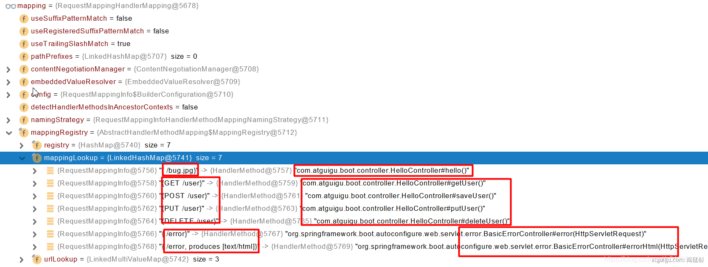

# 请求映射原理

`SpringMVC功`能分析都从 `org.springframework.web.servlet.DispatcherServlet` -> `doDispatch()` 开始，源码如下:

```java
protected void doDispatch(HttpServletRequest request, HttpServletResponse response) throws Exception {
    HttpServletRequest processedRequest = request;
    HandlerExecutionChain mappedHandler = null;
    boolean multipartRequestParsed = false;

    WebAsyncManager asyncManager = WebAsyncUtils.getAsyncManager(request);

    try {
        ModelAndView mv = null;
        Exception dispatchException = null;

        try {
            processedRequest = checkMultipart(request); // 检查是否为文件上传请求
            multipartRequestParsed = (processedRequest != request);

            // 找到当前请求使用哪个Handler（Controller的方法）处理
            mappedHandler = getHandler(processedRequest);

            //HandlerMapping：处理器映射。/xxx->>xxxx
    ...
}
```

`getHandler()`方法如下：

```java
@Nullable
protected HandlerExecutionChain getHandler(HttpServletRequest request) throws Exception {
    if (this.handlerMappings != null) {
        for (HandlerMapping mapping : this.handlerMappings) {
            HandlerExecutionChain handler = mapping.getHandler(request);
            if (handler != null) {
                return handler;
            }
        }
    }
    return null;
}
```

`this.handlerMappings`在Debug模式下展现的内容：


其中`RequestMappingHandlerMapping`保存了所有`@RequestMapping` 和`handler`的映射规则。如图：



所有的请求映射都在`HandlerMapping`中：

- `SpringBoot`自动配置欢迎页的 `WelcomePageHandlerMapping` 。访问 /能访问到index.html；
- `SpringBoot`自动配置了默认 的 `RequestMappingHandlerMapping`
- 请求进来，挨个尝试所有的`HandlerMapping`看是否有请求信息。

  - 如果有就找到这个请求对应的handler
  - 如果没有就是下一个 `HandlerMapping`

- 我们需要一些自定义的映射处理，我们也可以自己给容器中放`HandlerMapping`。自定义 `HandlerMapping`